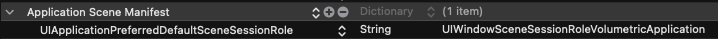
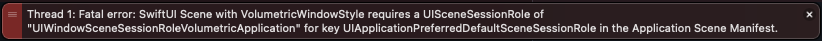
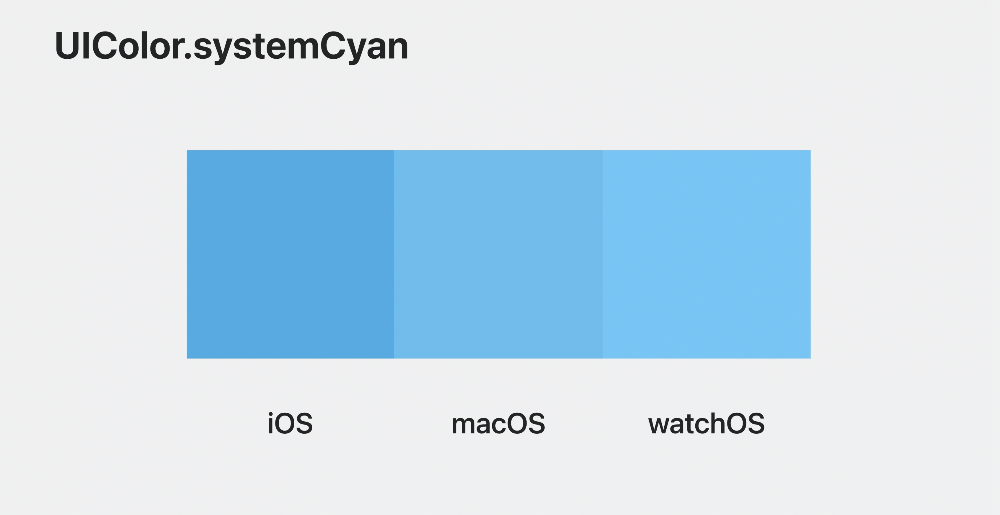

### How to migrate our app?

- No need to support 3D model 
	- just build for Vision (Design for iPad)
- Need to support 3D model -> build Vision Pro
	- Just care for the default UIs and colors

### What’s the difference between Vision Pro & Vision Pro(Design for iPad)?

		```Swift
    	#if os(xrOS)
    	// build for Vision Pro
    	#else
    	// build for Vision Pro(Design for iPad)
    	#endif
    	```        
- RealityKit & RealityKitContent only support Apple Vision instead of Apple Vision (Designed for iPad)

### Windows style:
- automatic:

```Swift
/// The default window style.
```
- plain:

```Swift
/// The plain window style.
///
/// Unlike ``WindowStyle/automatic``, a plain window does not receive a glass
/// background on xrOS. Use this style if you want more control over how glass
/// is used in your window.
```
- volumetric:

```Swift
/// A window style that creates a 3D volumetric window.
///
/// Volumetric windows are intended to host 3D content within a bounded
/// region. Content in this region will get true scale by default, and allows
/// someone to view the content from all angles without the scene contents
/// fading out. Volumes are intended for bounded content, so don't use them
/// for immersive experiences.
```

### When wanna use the volumetric window style
- You need to add `UIApplicationPreferredDefaultSceneSessionRole` with `UIWindowSceneSessionRoleVolumetricApplication` into Application Scene Manifest


- otherwise, it will cause a crash.



### APIs:
- **Some APIs are only supported by xrOS:**
	- ***New component and effects:***
		- `glassBackgroundEffect(displayMode:)`, `glassBackgroundEffect(in:displayMode:)`
		- `listRowHoverEffect(_:)`, `listRowHoverEffectDisabled(_:)`
		- `ornament(visibility:attachmentAnchor:contentAlignment:ornament:)`
	- ***3D:***
		- `offset(z:)`
		- `frame(depth:alignment:)`, `frame(minDepth:idealDepth:maxDepth:alignment:)`
		- `padding3D(_:)`, `padding3D(_:_:)`
		- `perspectiveRotationEffect(_:axis:anchor:anchorZ:perspective:)`
		- `rotation3DEffect(_:axis:anchor:)`
		- `scaleEffect(_:anchor:)`, `scaleEffect(x:y:z:anchor:)`
		- `transform3DEffect(_:)`

- **Some APIs are not supported by xrOS:**
    - `UIScreen`, `UIDeviceOrienctation`, `UITabBar leading and trailing` is unavailable in xrOS
    - `PencilKit` related features are not supported by the xrOS
    - UIPopoverPresentationController: `backgroundColor`, `popoverLayoutMargins`, `adaptiveSheetPresentationController` are not supported by the xrOS as well
    
### How to know now user executes the app on xrOS?
- `#if os(xrOS)`
- `UIDevice.current.userInterfaceIdiom == .reality`
- `UIViewController().traitCollection.userInterfaceIdiom`

### Colors


- same to the cases regards to .black, .white, and so on
- When you find all texts disappear on the xrOS, it is probably just caused by the colors.

### How to make UI with a Z offset that is similar to the native keyboard?
- offset
- You'll find out you have to add #if os(xrOS) everywhere
- Then you can start to use ViewModifier instead of using offset directly
	- `ToolsView`

### Can we create a view out of the window, just like how Apple demoed the Vision Pro?
- There's a new component that supports do like that: `ornament`
	- `TestingView`
- When your set up the window style with volumetric, and you set a z-axis offset to your component, it will display "looks like that."
- Also, you do have the capacity to create multiple windows for your app in the xrOS (Part II)
- However, there's no way to implement a 2D view out of its container window.
